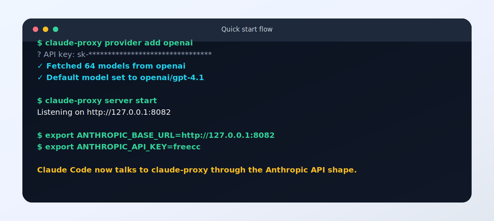
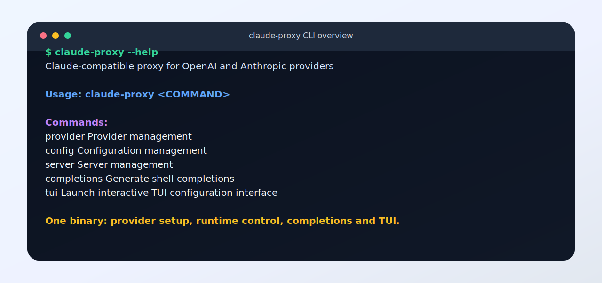
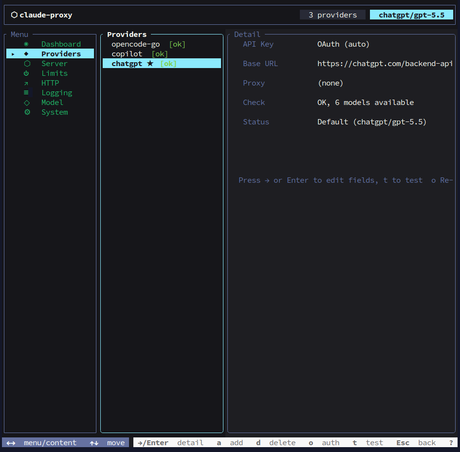
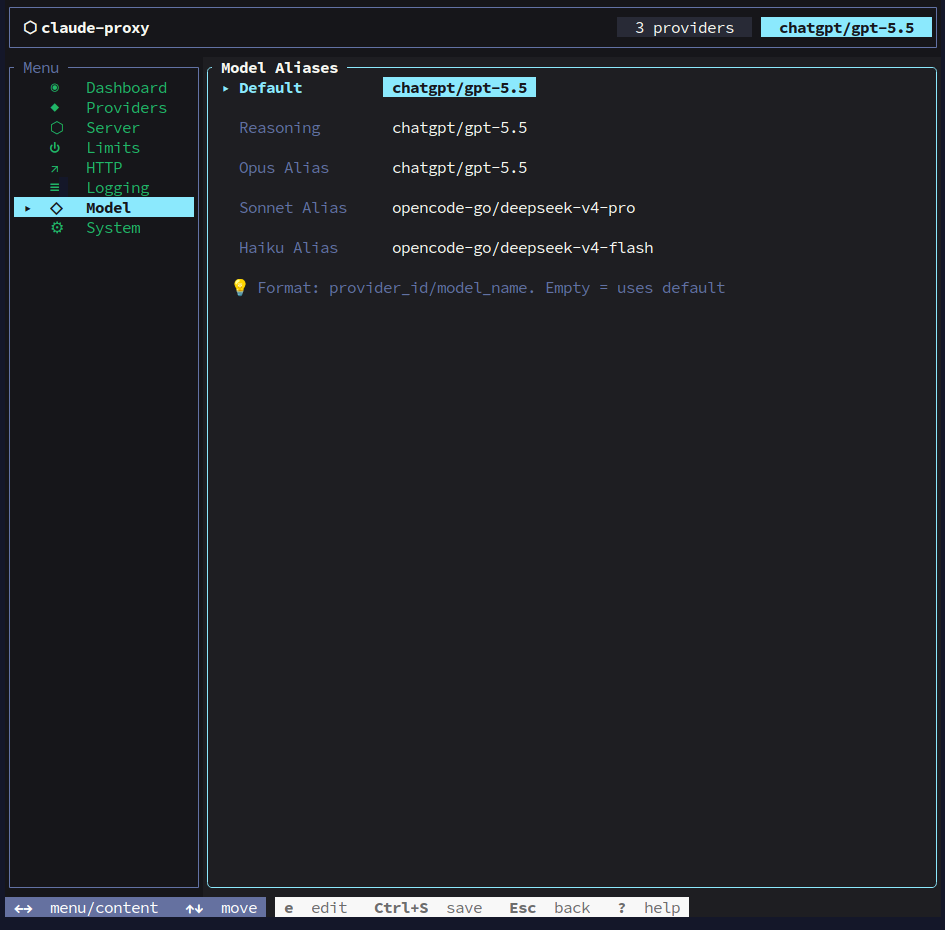
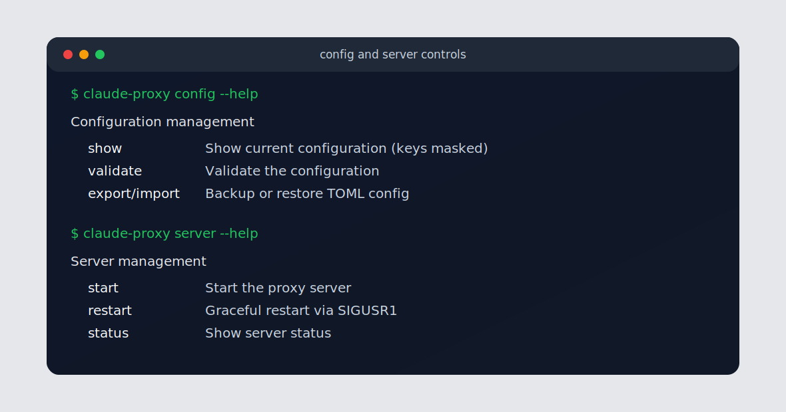
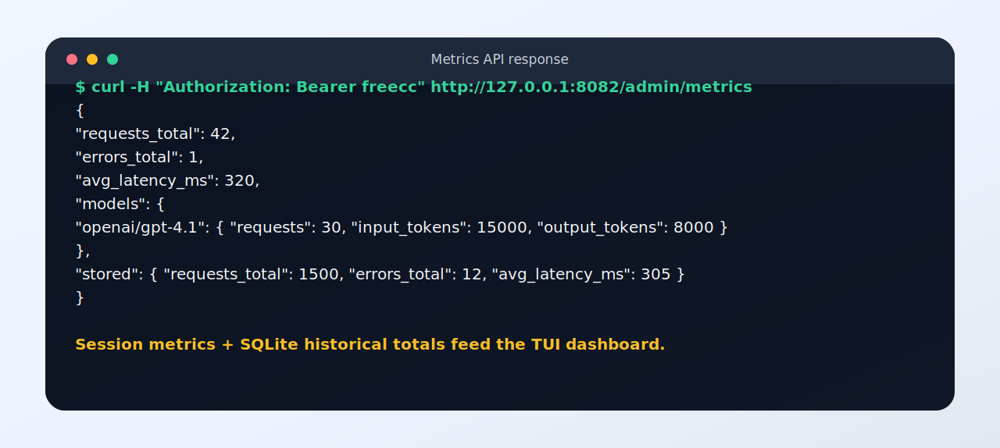

# claude-proxy

Claude 兼容代理服务器：把 Claude Code、Claude SDK 或任何 Anthropic Messages API 客户端的请求，路由到 OpenAI、Anthropic、GitHub Copilot、ChatGPT、OpenRouter、Google 或自定义兼容端点。

它是一个单个原生二进制文件，零运行时依赖，重点解决三件事：统一 Claude 入口、灵活切换上游模型、用 CLI/TUI 管理真实生产运行状态。

[English](README_EN.md)

## 为什么选择 claude-proxy

- **面向 Claude Code 的兼容层**：对外提供 Anthropic Messages API，对内适配多种上游服务，Claude Code 只需要配置一个 `ANTHROPIC_BASE_URL`。
- **多 Provider 原生路由**：同一份配置里可混用 OpenAI、Anthropic、Copilot、ChatGPT、OpenRouter、Google 和私有兼容服务。
- **账号型 Provider 支持**：Copilot 和 ChatGPT 使用 OAuth 登录，不需要手动维护 API key。
- **模型别名与快速切换**：通过 `provider_id/model` 精确路由，也可以用 `opus`、`sonnet`、`haiku`、`reasoning` 等别名映射 Claude 模型名。
- **终端可观测性**：内置 TUI Dashboard、模型用量统计、延迟、错误数和 SQLite 历史累计数据。
- **运行时控制完整**：支持限流、全局并发、单 Provider 并发、配置热重载、守护进程、模型缓存预热和重复请求去重。
- **适合本地与团队网关**：原生二进制易部署，可接入代理、额外 CA 证书和自定义 OpenAI/Anthropic 兼容网关。

## 截图预览

### 1. 快速接入 Claude Code

从添加 provider、启动服务到设置 `ANTHROPIC_BASE_URL`，核心路径只需要几条命令。



### 2. CLI 总览

一个二进制覆盖 provider、配置、服务、补全和 TUI，不需要额外运行时或后台管理面板。



### 3. 多 Provider 管理

TUI 可以集中查看 OpenAI、Anthropic、Copilot、ChatGPT、OpenRouter、Google 和自定义 Provider，并快速切换默认模型。



### 4. 模型路由配置

Model 页面展示默认模型和 Claude alias 的路由关系，方便确认 `opus`、`sonnet`、`haiku` 等别名最终会落到哪个上游模型。



### 5. 配置与服务控制

配置查看会自动脱敏；服务侧支持前台运行、Unix daemon、SIGUSR1 reload 和状态查询。



### 6. TUI 模型选择

TUI 提供键盘导航的模型选择、Provider 管理和配置入口，适合不想手写 TOML 的场景。


### 7. TUI 指标仪表盘

Dashboard 会展示请求数、错误数、延迟和按模型聚合的 token 用量，并合并 SQLite 历史累计数据。


### 8. Metrics API

管理接口可直接返回 JSON 指标，方便接入脚本、监控或自定义 dashboard。



### 9. 在 Claude Code 中使用

设置环境变量后，Claude Code 可以像访问 Anthropic API 一样访问本地代理。


## 安装

Linux / macOS:

```bash
curl -fsSL https://github.com/MorseWayne/claude-proxy/releases/latest/download/install.sh | bash
```

Windows PowerShell:

```powershell
irm https://github.com/MorseWayne/claude-proxy/releases/latest/download/install.ps1 | iex
```

或从 [GitHub Releases](https://github.com/MorseWayne/claude-proxy/releases) 下载预编译二进制。

## 快速开始

```bash
# 添加 OpenAI provider（交互式输入 API key，并自动拉取模型列表）
claude-proxy provider add openai

# 添加 GitHub Copilot provider（自动引导 OAuth 认证）
claude-proxy provider add copilot

# 添加 ChatGPT provider（使用 ChatGPT Pro/Plus 账号 OAuth 认证）
claude-proxy provider add chatgpt

# 启动代理服务
claude-proxy server start

# 将 Claude Code 指向本地代理
export ANTHROPIC_BASE_URL=http://127.0.0.1:8082
export ANTHROPIC_API_KEY=freecc
```

之后，Claude Code 发出的 Anthropic Messages API 请求会进入 `claude-proxy`，再按配置路由到对应上游模型。

## 支持的 Provider

| Provider | 认证方式 | 默认/典型端点 | 适用场景 |
|----------|----------|---------------|----------|
| OpenAI | API key | `https://api.openai.com/v1` | 使用 GPT 系列模型或 OpenAI 兼容模型 |
| Anthropic | API key | `https://api.anthropic.com` | 直接代理官方 Claude API |
| GitHub Copilot | OAuth | `https://api.githubcopilot.com` | 使用 Copilot 账号作为 Claude Code 上游 |
| ChatGPT | OAuth | `https://chatgpt.com/backend-api/codex` | 使用 ChatGPT Pro/Plus 账号能力 |
| OpenRouter | API key | `https://openrouter.ai/api/v1` | 通过统一市场访问多家模型 |
| Google | API key | `https://generativelanguage.googleapis.com/v1beta` | 接入 Gemini / Google 兼容接口 |
| Custom OpenAI | API key | 自定义 | 接入 one-api、new-api、LiteLLM、LocalAI、vLLM 等 OpenAI 兼容网关 |
| Custom Anthropic | API key | 自定义 | 接入 Anthropic 兼容私有网关 |

## 工作方式

```text
Claude Code / SDK / Client
        │
        │ Anthropic Messages API
        ▼
claude-proxy /v1/messages
        │
        ├─ 认证：x-api-key 或 Authorization: Bearer
        ├─ 限流：按 API key 的 token bucket
        ├─ 并发：全局并发 + 单 Provider 并发
        ├─ 路由：model alias 或 provider_id/upstream_model
        ├─ 去重：相同并发请求共享同一个上游流
        ├─ 转换：OpenAI/兼容流转换为 Anthropic SSE
        └─ 指标：实时内存统计 + SQLite 历史持久化
        │
        ▼
OpenAI / Anthropic / Copilot / ChatGPT / OpenRouter / Google / Custom
```

### 模型路由

`[model].default` 使用 `provider_id/upstream_model` 格式：

```toml
[model]
default = "openai/gpt-4.1"
reasoning = "openai/o4-mini"
opus = "anthropic/claude-opus-4-20250514"
sonnet = "anthropic/claude-sonnet-4-20250514"
haiku = "anthropic/claude-haiku-4-5-20251001"
```

当客户端请求 Claude 模型名时，`claude-proxy` 会优先匹配别名；没有命中时，则使用默认 provider 并把模型名原样传给上游。

## CLI 命令

### Provider 管理

```bash
claude-proxy provider list              # 列出已配置的 provider
claude-proxy provider current           # 显示当前默认模型
claude-proxy provider add [id]          # 添加 provider（省略 ID 则交互式输入）
claude-proxy provider edit <id>         # 编辑 provider 配置
claude-proxy provider delete <id>       # 删除 provider
claude-proxy provider switch <id>       # 切换默认模型到指定 provider
claude-proxy provider test <id>         # 测试 API key 是否可用
claude-proxy provider speedtest <id>    # 测试 provider 延迟
claude-proxy provider fetch-models <id> # 拉取并缓存模型列表
```

### 配置管理

```bash
claude-proxy config show                # 查看配置（密钥脱敏）
claude-proxy config edit                # 用 $EDITOR 打开配置文件
claude-proxy config validate            # 校验配置文件
claude-proxy config path                # 打印配置文件路径
claude-proxy config export [path]       # 导出配置（省略路径则输出到 stdout）
claude-proxy config import <path>       # 从文件导入配置
```

### 服务管理

```bash
claude-proxy server start               # 前台启动代理服务
claude-proxy server start --daemon      # 以守护进程启动（仅 Unix）
claude-proxy server stop                # 停止守护进程（仅 Unix）
claude-proxy server restart             # 通过 SIGUSR1 重载配置（仅 Unix）
claude-proxy server status              # 查看守护进程运行状态
```

### Shell 补全

```bash
claude-proxy completions bash           # 生成 bash 补全脚本
claude-proxy completions zsh            # 生成 zsh 补全脚本
claude-proxy completions fish           # 生成 fish 补全脚本
claude-proxy completions powershell     # 生成 PowerShell 补全脚本
```

添加到 shell（以 bash 为例）：

```bash
eval "$(claude-proxy completions bash)"
```

## TUI 终端控制台

```bash
claude-proxy tui
```

TUI 提供 8 个页面：Dashboard、Providers、Server、Limits、HTTP、Logging、Model、System。

适合用它完成这些操作：

- 查看当前请求总数、错误数、平均延迟和各模型 token 用量。
- 查看 SQLite 持久化后的历史累计数据，重启后仍可追踪成本趋势。
- 管理 Provider、默认模型、服务器监听地址、限流、HTTP 超时和日志开关。
- 在终端里完成配置编辑，避免手动修改 TOML 时漏字段。

## 配置文件

路径：`~/.config/claude-proxy/config.toml`

```toml
[providers.openai]
api_key = "sk-..."
base_url = "https://api.openai.com/v1"
proxy = ""                              # 可选，HTTP 代理地址
provider_type = "openai"                # 可选；省略时按 provider ID 推断

[providers.openrouter]
api_key = "sk-or-..."
base_url = "https://openrouter.ai/api/v1"
provider_type = "openrouter"

[providers.anthropic]
api_key = "sk-ant-..."
base_url = "https://api.anthropic.com"
provider_type = "anthropic"

# GitHub Copilot provider（OAuth 自动认证，无需 api_key）
[providers.copilot]
base_url = "https://api.githubcopilot.com"
provider_type = "copilot"

[providers.copilot.copilot]
oauth_app = "vscode"                    # OAuth 应用: "vscode" 或 "opencode"
small_model = "gpt-5-mini"              # warmup 降级模型
max_thinking_tokens = 16000              # 最大思考 token 数
enable_warmup = true                     # 启用 warmup 检测（无工具请求自动降级）
enable_tool_result_merge = true          # 启用 tool_result 合并
enable_compact_detection = true          # 启用 compact/auto-continue 检测
enable_agent_marking = true              # 启用子 agent 流量标记
enable_responses_api = true              # 对 Copilot 启用 Responses API 路径

# ChatGPT provider（OAuth 自动认证，无需 api_key）
[providers.chatgpt]
base_url = "https://chatgpt.com/backend-api/codex"
provider_type = "chatgpt"

[model]
default = "openai/gpt-4.1"
reasoning = "openai/o4-mini"
opus = "anthropic/claude-opus-4-20250514"
sonnet = "anthropic/claude-sonnet-4-20250514"
haiku = "anthropic/claude-haiku-4-5-20251001"

[server]
host = "127.0.0.1"
port = 8082
auth_token = "freecc"                   # 客户端连接所需的 API key

[admin]
auth_token = ""                         # 留空时使用 server.auth_token

[limits]
rate_limit = 40                         # 时间窗口内最大请求数
rate_window = 60                        # 时间窗口（秒）
max_concurrency = 5                     # 全局最大并发请求数
provider_max_concurrency = 4            # 单个上游 provider 最大并发请求数

[http]
read_timeout = 300                      # 上游读取超时（秒）
write_timeout = 60                      # 上游写入超时（秒）
connect_timeout = 60                    # 上游连接超时（秒）
extra_ca_certs = []                     # 额外 CA 证书路径，适合企业 TLS 代理

[log]
level = "info"
file = ""                               # 默认写入 config_dir/claude-proxy.log
with_stdout = true
raw_api_payloads = false                # 调试时再开启，可能包含敏感信息
raw_sse_events = false
```

## HTTP API

### 代理接口

| 方法 | 路径 | 说明 |
|------|------|------|
| `GET` | `/health` | 健康检查 |
| `POST` | `/v1/messages` | Anthropic Messages API 代理 |
| `GET` | `/v1/models` | 获取可用模型列表 |

### 管理接口

管理接口需要 `Authorization: Bearer <admin_token>`。如果未设置 `admin.auth_token`，会使用 `server.auth_token` 作为 fallback。

| 方法 | 路径 | 说明 |
|------|------|------|
| `GET` | `/admin/config` | 获取当前配置（密钥脱敏） |
| `PUT` | `/admin/config` | 更新配置（请求体：`{"config": "<toml>"}`） |
| `POST` | `/admin/restart` | 从磁盘重新加载配置 |
| `GET` | `/admin/metrics` | 获取请求指标（含全量历史数据） |

`GET /admin/metrics` 返回 JSON：

```json
{
  "requests_total": 42,
  "errors_total": 1,
  "avg_latency_ms": 320,
  "models": {
    "openai/gpt-4.1": {
      "requests": 30,
      "input_tokens": 15000,
      "output_tokens": 8000,
      "cache_creation_input_tokens": 0,
      "cache_read_input_tokens": 2000
    }
  },
  "stored": {
    "requests_total": 1500,
    "errors_total": 12,
    "avg_latency_ms": 305,
    "models": {}
  }
}
```

- 顶层字段是当前进程会话内的统计。
- `stored` 是 SQLite 持久化的历史累计，跨重启保留。
- TUI Dashboard 会合并实时数据和历史数据展示总计。

## 特性清单

| 能力 | 说明 |
|------|------|
| Anthropic Messages API 兼容 | 对 Claude Code/SDK 暴露熟悉的 `/v1/messages` 接口 |
| OpenAI 流式转换 | 将 OpenAI Chat Completion SSE 转为 Anthropic SSE |
| Anthropic 透传 | 支持官方 Anthropic API 和自定义 Anthropic 兼容端点 |
| Copilot OAuth | 自动完成 GitHub OAuth，模拟 VS Code/Copilot 请求头 |
| ChatGPT OAuth | 使用 ChatGPT 账号 device flow，token 保存在本机配置目录 |
| Provider 模型缓存 | 启动时预热模型列表，TUI/CLI 可复用缓存 |
| 重复请求去重 | 相同并发请求共享一次上游调用，减少浪费 |
| 限流与并发 | API key 级限流、全局并发、单 Provider 并发保护 |
| 热重载 | 文件监听和 SIGUSR1 均可触发配置 reload |
| 持久化指标 | 请求、错误、延迟、模型 token 用量写入 SQLite |
| TUI Dashboard | 终端内查看实时/历史统计和配置状态 |
| 企业网络支持 | Provider 代理和 `extra_ca_certs` 适配企业 TLS 拦截环境 |
| Shell 补全 | bash、zsh、fish、PowerShell、Elvish 补全脚本 |

## 与其他开源工具对比

| 工具 | 核心定位 | claude-proxy 的差异 |
|------|----------|---------------------|
| LiteLLM Proxy | 通用 LLM 网关，覆盖大量模型 API | claude-proxy 更聚焦 Claude Code/Anthropic Messages API 本地代理，单二进制和 TUI 更轻量 |
| OpenRouter | 托管式多模型路由平台 | claude-proxy 可把 OpenRouter 作为上游，同时保留本地配置、认证和指标控制权 |
| LocalAI / vLLM | 本地模型推理服务 | claude-proxy 不负责推理，而是统一转发到云端、账号型或私有兼容上游 |
| one-api / new-api | 多渠道 API 分发与管理面板 | claude-proxy 更适合开发者本机和 Claude Code 工作流，支持 Copilot/ChatGPT OAuth 与终端操作 |
| 简单反向代理 | HTTP 转发 | claude-proxy 会理解 Anthropic/OpenAI 协议、模型路由、流式事件、token 指标和 Provider 生命周期 |

如果你已经有 LiteLLM、one-api、new-api 或自建 OpenAI 兼容网关，`claude-proxy` 仍然可以作为 Claude Code 前置适配层，把这些服务包装成 Claude 兼容入口。

## 典型使用场景

- **Claude Code 多模型切换**：在一个终端会话里用不同 alias 切换 GPT、Claude、Gemini 或 OpenRouter 模型。
- **复用 Copilot / ChatGPT 账号能力**：通过 OAuth provider 接入账号型上游，减少手动管理 token 的成本。
- **团队内统一出口**：给团队提供一个 Anthropic 兼容入口，同时在本地记录用量和延迟。
- **企业网络环境**：通过代理和额外 CA 证书访问上游模型服务。
- **调试模型成本**：用 TUI Dashboard 观察模型维度 token 用量和错误率。

## 从源码构建

```bash
cargo build --release
# 二进制文件位于 target/release/claude-proxy
```

常用开发命令：

```bash
cargo test
cargo clippy -- -D warnings
cargo fmt --check
```

## 许可证

MIT
