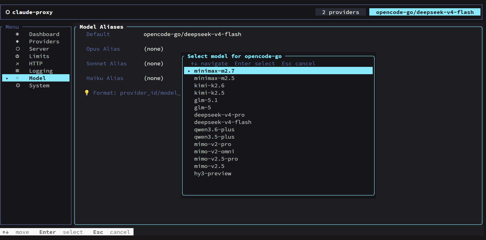
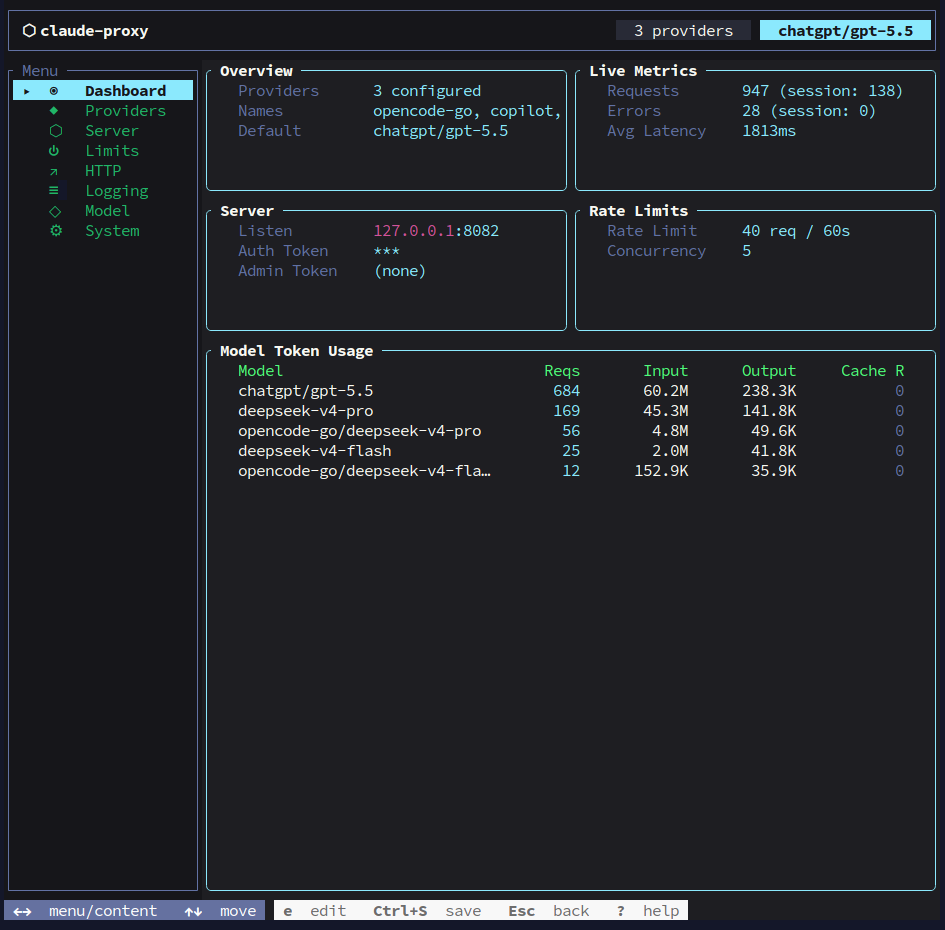
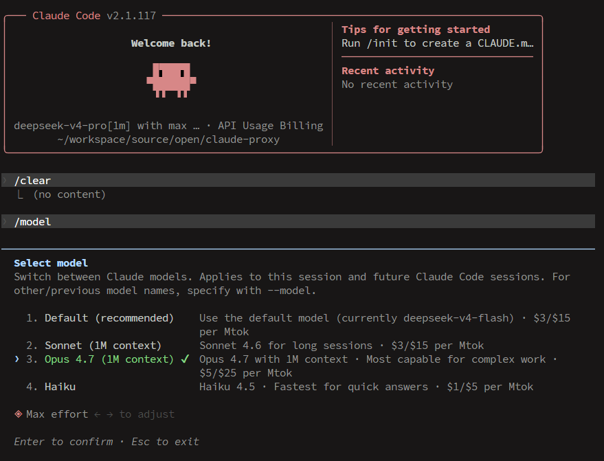

# claude-proxy

Claude 兼容代理服务器，将请求路由到 OpenAI、Anthropic 或 **GitHub Copilot** 等上游服务。

单个原生二进制文件，零运行时依赖。

[English](README_EN.md)

## 安装

Linux / macOS:

```bash
curl -fsSL https://github.com/MorseWayne/claude-proxy/releases/latest/download/install.sh | bash
```

Windows PowerShell:

```powershell
irm https://github.com/MorseWayne/claude-proxy/releases/latest/download/install.ps1 | iex
```

或从 [GitHub Releases](https://github.com/MorseWayne/claude-proxy/releases) 下载。

## 快速开始

```bash
# 添加一个 provider（自动拉取可用模型列表让你选默认模型）
claude-proxy provider add openai

# 添加 GitHub Copilot（自动引导 OAuth 认证）
claude-proxy provider add copilot

# 启动服务
claude-proxy server start

# 将 Claude Code 指向代理
export ANTHROPIC_BASE_URL=http://127.0.0.1:8082
export ANTHROPIC_API_KEY=freecc
```

## CLI 命令

### Provider 管理

```bash
claude-proxy provider list              # 列出已配置的 provider
claude-proxy provider current           # 显示当前默认模型
claude-proxy provider add [id]          # 添加 provider（省略 ID 则交互式输入）
claude-proxy provider edit <id>         # 编辑 provider 配置
claude-proxy provider delete <id>       # 删除 provider
claude-proxy provider switch <id>       # 切换默认模型到指定 provider
claude-proxy provider test <id>         # 测试 API key 是否可用
claude-proxy provider speedtest <id>    # 测试 provider 延迟
claude-proxy provider fetch-models <id> # 拉取并缓存模型列表
```

### 配置管理

```bash
claude-proxy config show                # 查看配置（密钥脱敏）
claude-proxy config edit                # 用 $EDITOR 打开配置文件
claude-proxy config validate            # 校验配置文件
claude-proxy config path                # 打印配置文件路径
claude-proxy config export [path]       # 导出配置（省略路径则输出到 stdout）
claude-proxy config import <path>       # 从文件导入配置
```

### 服务管理

```bash
claude-proxy server start               # 前台启动代理服务
claude-proxy server start --daemon      # 以守护进程启动（仅 Unix）
claude-proxy server stop                # 停止守护进程（仅 Unix）
claude-proxy server restart             # 通过 SIGUSR1 重载配置（仅 Unix）
claude-proxy server status              # 查看守护进程运行状态
```

### Shell 补全

```bash
claude-proxy completions bash           # 生成 bash 补全脚本
claude-proxy completions zsh            # 生成 zsh 补全脚本
claude-proxy completions fish           # 生成 fish 补全脚本
```

添加到 shell（以 bash 为例）：

```bash
eval "$(claude-proxy completions bash)"
```

### TUI 配置界面

```bash
claude-proxy tui                        # 启动交互式终端 UI 配置界面
```

支持键盘导航的配置管理、Provider 管理、模型列表查看等功能。



## 配置文件

路径：`~/.config/claude-proxy/config.toml`

```toml
[providers.openai]
api_key = "sk-..."
base_url = "https://api.openai.com/v1"
proxy = ""                              # 可选，HTTP 代理地址

# GitHub Copilot provider（OAuth 自动认证，无需 api_key）
[providers.copilot]
base_url = "https://api.githubcopilot.com"

[providers.copilot.copilot]
oauth_app = "vscode"                    # OAuth 应用: "vscode" 或 "opencode"
small_model = "gpt-5-mini"             # warmup 降级模型
max_thinking_tokens = 16000             # 最大思考 token 数
enable_warmup = true                    # 启用 warmup 检测（无工具请求自动降级）
enable_tool_result_merge = true         # 启用 tool_result 合并（减少 premium 计费）
enable_compact_detection = true         # 启用 compact/auto-continue 检测
enable_agent_marking = true             # 启用子 agent 流量标记

[model]
default = "openai/gpt-4.1"
opus = "anthropic/claude-opus-4-20250514"      # 可选，模型别名
sonnet = "anthropic/claude-sonnet-4-20250514"
haiku = "anthropic/claude-haiku-4-5-20251001"

[server]
host = "127.0.0.1"
port = 8082
auth_token = "freecc"                   # 客户端连接所需的 API key

[admin]
auth_token = ""                         # 管理接口 token（留空则使用 server.auth_token 作为 fallback）

[limits]
rate_limit = 40                         # 时间窗口内最大请求数
rate_window = 60                        # 时间窗口（秒）
max_concurrency = 5                     # 最大并发请求数

[http]
read_timeout = 300                      # 上游读取超时（秒）
write_timeout = 60                      # 上游写入超时（秒）
connect_timeout = 60                    # 上游连接超时（秒）

[log]
level = "info"                          # 日志级别（trace/debug/info/warn/error）
file = ""                               # 可选，日志文件路径（默认输出到 config_dir/claude-proxy.log）
with_stdout = true                      # 同时输出到 stderr（前台服务及 CLI 使用）
raw_api_payloads = false                # 是否记录原始请求载荷
raw_sse_events = false                  # 是否记录原始 SSE 事件
```

### 模型路由

`default` 字段使用 `provider_id/upstream_model` 格式。例如 `openai/gpt-4.1` 会路由到 `openai` provider，并以 `gpt-4.1` 作为模型名发送给上游。

Claude 模型名（如 `claude-opus-4-20250514`）会通过 `[model]` 中的别名自动解析。如果没有匹配的别名，则使用默认 provider 并将模型名原样传递。

## HTTP API

### 代理接口

| 方法 | 路径 | 说明 |
|------|------|------|
| `GET` | `/health` | 健康检查 |
| `POST` | `/v1/messages` | Anthropic Messages API 代理 |
| `GET` | `/v1/models` | 获取可用模型列表 |

### 管理接口

所有管理接口需要 `Authorization: Bearer <admin_token>` 认证。若未设置 admin_token 则使用 `server.auth_token` 作为 fallback。

| 方法 | 路径 | 说明 |
|------|------|------|
| `GET` | `/admin/config` | 获取当前配置（密钥脱敏） |
| `PUT` | `/admin/config` | 更新配置（请求体：`{"config": "<toml>"}`） |
| `POST` | `/admin/restart` | 从磁盘重新加载配置 |
| `GET` | `/admin/metrics` | 获取请求指标（含全量历史数据） |

`GET /admin/metrics` 返回 JSON 格式：

```json
{
  "requests_total": 42,
  "errors_total": 1,
  "avg_latency_ms": 320,
  "models": {
    "openai/gpt-4.1": {
      "requests": 30,
      "input_tokens": 15000,
      "output_tokens": 8000,
      "cache_creation_input_tokens": 0,
      "cache_read_input_tokens": 2000
    }
  },
  "stored": {
    "requests_total": 1500,
    "errors_total": 12,
    "avg_latency_ms": 305,
    "models": { ... }
  }
}
```

- 顶层字段：当前进程会话期间的统计数据
- `stored` 字段：SQLite 持久化的全量历史累计数据（跨重启保留）
- Dashboard 自动合并两层数据展示总计

## 特性

- **多 Provider 支持**：OpenAI、Anthropic、GitHub Copilot 及任意 OpenAI 兼容 API
- **Copilot 集成**：完整的 GitHub OAuth 认证、VS Code 伪装、Premium 请求优化
- **模型自动发现**：添加 provider 时自动拉取可用模型列表，交互式选择默认模型
- **TUI 配置界面**：内置终端 UI，支持键盘导航的配置管理和 Provider 管理
- **速率限制**：基于 API key 的令牌桶限流
- **并发控制**：基于信号量的并发限制，带超时机制
- **配置热重载**：文件监听 + SIGUSR1 信号双重触发
- **守护进程**：后台运行，PID 文件管理（仅 Unix）
- **模型缓存预热**：启动时自动拉取所有 provider 的模型列表
- **Token 用量统计**：按模型维度的 token 输入/输出/缓存用量追踪，含实时数据和全量历史
- **持久化存储**：用量数据自动存入 SQLite（`~/.config/claude-proxy/metrics.db`），重启不丢失
- **TUI Dashboard**：终端仪表盘实时显示请求数、错误率、延迟、各模型 token 用量
- **配置迁移**：自动从旧版 `.env` 迁移到 TOML 配置
- **优雅关闭**：处理 SIGINT 和 SIGTERM 信号，确保干净退出

## 截图

### TUI 仪表盘


### 在 Claude Code 中使用


## 从源码构建

```bash
cargo build --release
# 二进制文件位于 target/release/claude-proxy
```

## 许可证

MIT
