# claude-proxy

**让 Claude Code 自由使用 ChatGPT/Codex、OpenAI、GitHub Copilot、Gemini、OpenRouter、Anthropic 和自定义模型。**

> Use Claude Code with the models and accounts you already have — through one fast, observable gateway.

[](https://github.com/MorseWayne/claude-proxy/actions/workflows/ci.yml)
[](https://github.com/MorseWayne/claude-proxy/actions/workflows/release.yml)
[](https://github.com/MorseWayne/claude-proxy/releases/latest)
[](https://www.rust-lang.org/)
[](#许可证)

[English](README.md) · [立即安装](#安装) · [快速开始](#快速开始) · [查看 Provider](#支持的-provider)

`claude-proxy` 是面向 Claude Code 和 Anthropic Messages API 客户端的多模型网关。它以单个原生二进制运行，零运行时依赖，并通过 CLI/TUI 统一管理模型路由、账号认证和生产运行状态。

## 为什么选择 claude-proxy

- **已有账号直接接入**：ChatGPT 和 GitHub Copilot 支持 OAuth，无需手动维护 API key。
- **多 Provider 原生路由**：一份配置同时使用 OpenAI、Anthropic、Copilot、ChatGPT、OpenRouter、Google 和私有兼容服务。
- **Claude Code 上下文增强**：为符合条件的 ChatGPT 模型提供虚拟 1M 投影、本地上下文预检和自动压缩信号。
- **按模型能力配置推理**：模型别名、推理强度和能力约束由真实模型元数据驱动，避免发送不支持的参数。
- **可观察、可运营**：内置 TUI Dashboard、SQLite 历史指标、限流、并发控制、热重载、守护进程和请求去重。
- **单文件部署**：原生 Rust 二进制，零运行时依赖，适合个人工作站和团队网关。

## 安装

Linux / macOS:

```bash
curl -fsSL https://github.com/MorseWayne/claude-proxy/releases/latest/download/install.sh | bash
```

Windows PowerShell:

```powershell
irm https://github.com/MorseWayne/claude-proxy/releases/latest/download/install.ps1 | iex
```

或从 [GitHub Releases](https://github.com/MorseWayne/claude-proxy/releases) 下载预编译二进制。Linux x86_64 安装脚本默认下载静态链接的 `x86_64-unknown-linux-musl` 版本；`x86_64-unknown-linux-gnu` 版本仍可在 Releases 中手动下载。

## 快速开始

```bash
# 添加 OpenAI provider（交互式输入 API key，并自动拉取模型列表）
claude-proxy provider add openai

# 添加 GitHub Copilot provider（自动引导 OAuth 认证）
claude-proxy provider add copilot

# 添加 ChatGPT provider（使用 ChatGPT Pro/Plus 账号 OAuth 认证）
claude-proxy provider add chatgpt

# 启动代理服务
claude-proxy server start

# 将 Claude Code 指向本地代理
export ANTHROPIC_BASE_URL=http://127.0.0.1:8082
export ANTHROPIC_API_KEY=freecc
```

之后，Claude Code 发出的 Anthropic Messages API 请求会进入 `claude-proxy`，再按配置路由到对应上游模型。

## 界面预览

在一个 TUI 中管理 Provider、模型路由、OAuth 登录和运行指标：

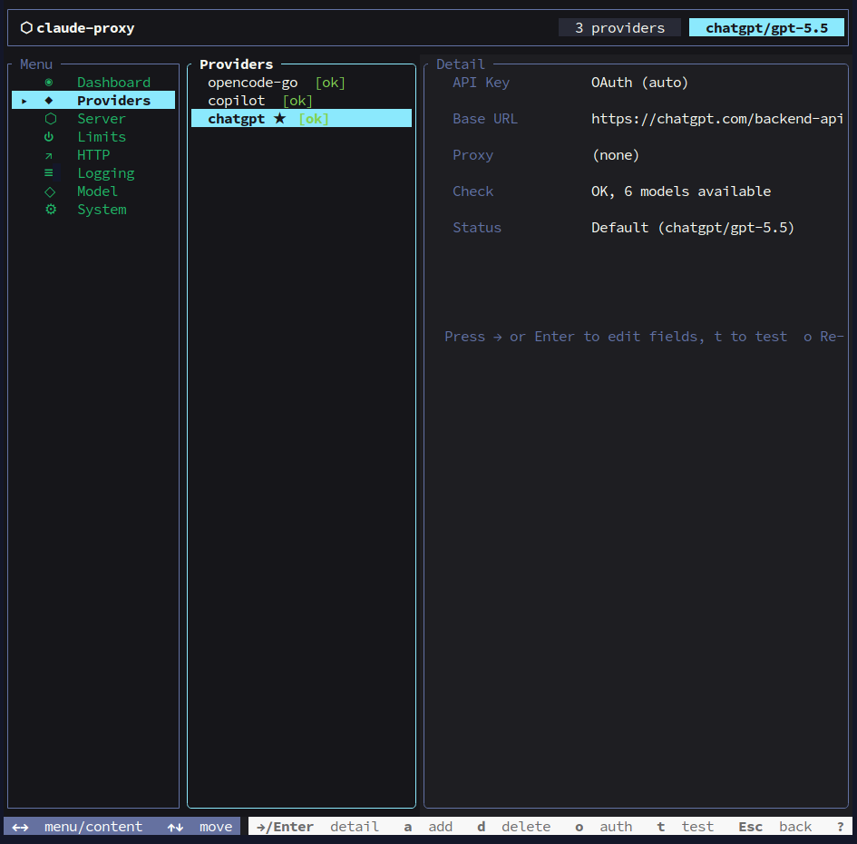

<details>
<summary>查看更多 CLI、TUI 与 Claude Code 集成截图</summary>

### 快速接入 Claude Code

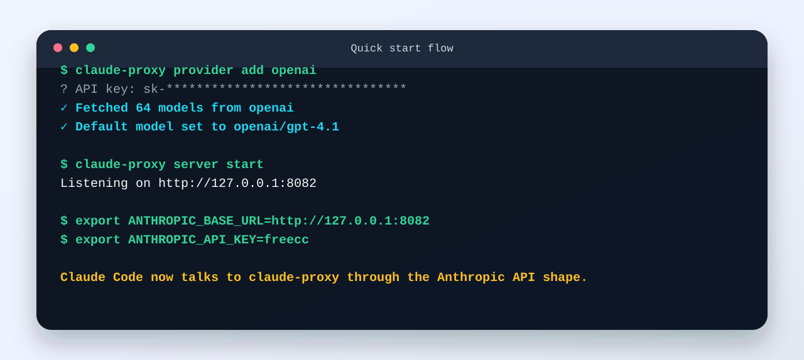

### CLI 总览

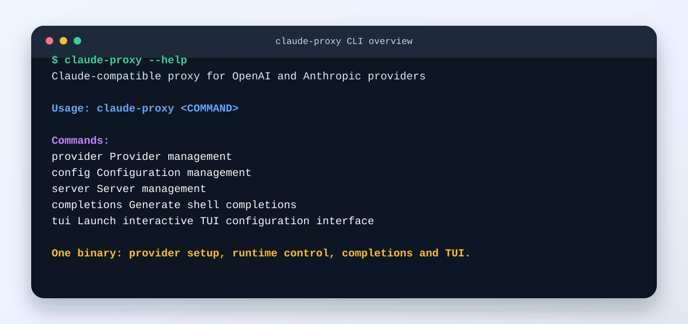

### 模型路由配置

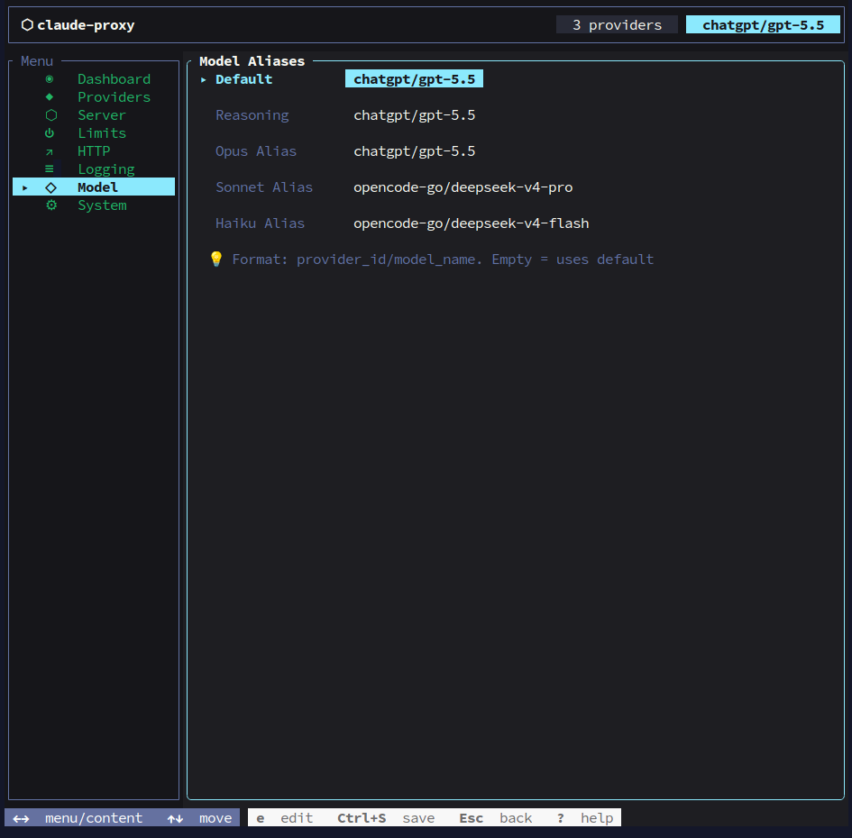

### 配置与服务控制

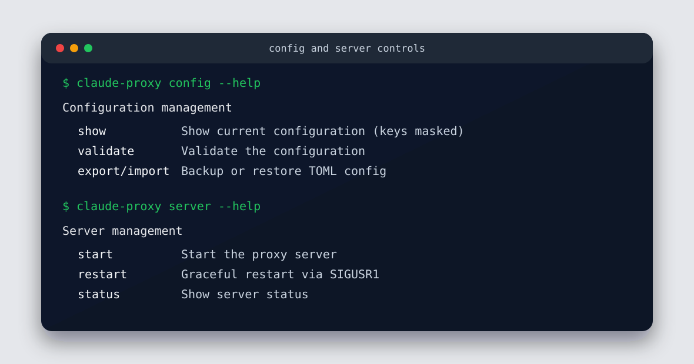

### TUI 模型选择

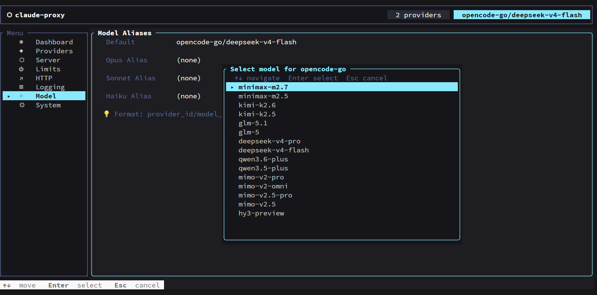

### TUI 指标仪表盘

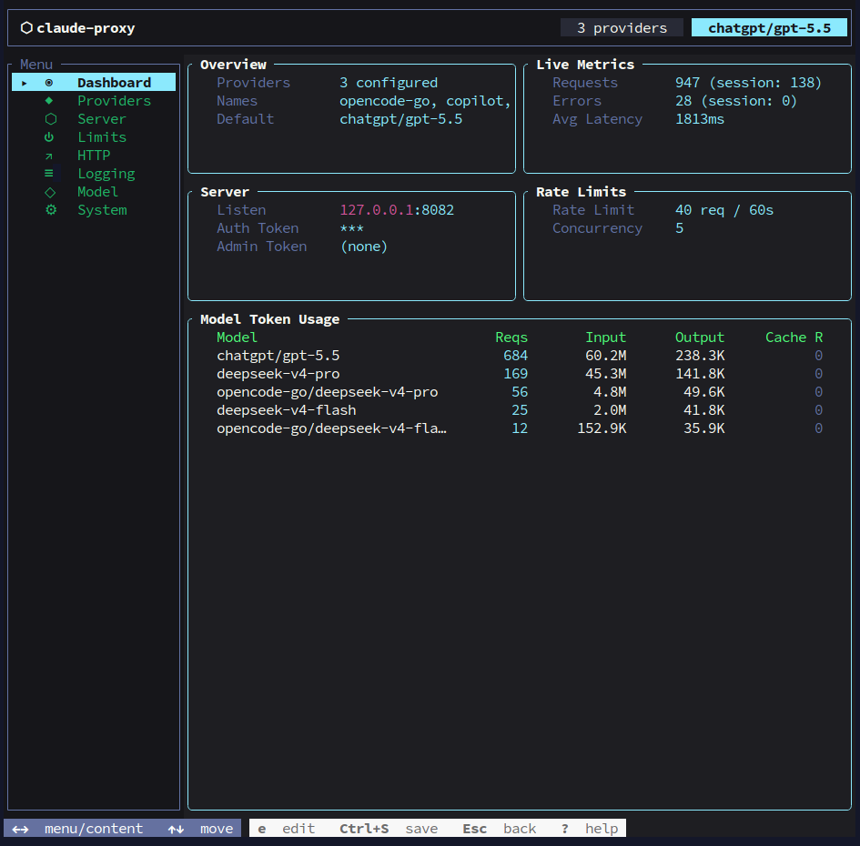

### Metrics API

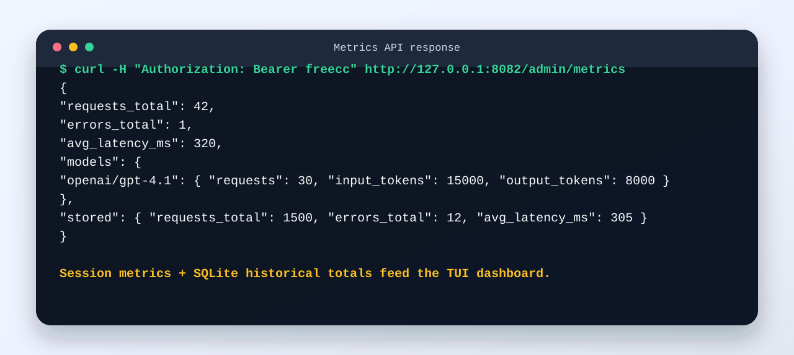

### 在 Claude Code 中使用

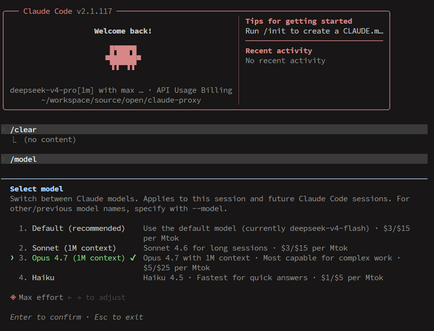

</details>

## 支持的 Provider

| Provider | 认证方式 | 默认/典型端点 | 适用场景 |
|----------|----------|---------------|----------|
| OpenAI | API key | `https://api.openai.com/v1` | 使用 GPT 系列模型或 OpenAI 兼容模型 |
| Anthropic | API key | `https://api.anthropic.com` | 直接代理官方 Claude API |
| GitHub Copilot | OAuth | `https://api.githubcopilot.com` | 使用 Copilot 账号作为 Claude Code 上游 |
| ChatGPT | OAuth | `https://chatgpt.com/backend-api/codex` | 使用 ChatGPT Pro/Plus 账号能力 |
| OpenRouter | API key | `https://openrouter.ai/api/v1` | 通过统一市场访问多家模型 |
| Google | API key | `https://generativelanguage.googleapis.com/v1beta` | 接入 Gemini / Google 兼容接口 |
| Custom OpenAI | API key | 自定义 | 接入 one-api、new-api、LiteLLM、LocalAI、vLLM 等 OpenAI 兼容网关 |
| Custom Anthropic | API key | 自定义 | 接入 Anthropic 兼容私有网关 |

## 工作方式

```text
Claude Code / SDK / Client
        │
        │ Anthropic Messages API
        ▼
claude-proxy /v1/messages
        │
        ├─ 认证：x-api-key 或 Authorization: Bearer
        ├─ 限流：按 API key 的 token bucket
        ├─ 并发：全局并发 + 单 Provider 并发
        ├─ 路由：model alias 或 provider_id/upstream_model
        ├─ 去重：相同并发请求共享同一个上游流
        ├─ 转换：OpenAI/兼容流转换为 Anthropic SSE
        └─ 指标：实时内存统计 + SQLite 历史持久化
        │
        ▼
OpenAI / Anthropic / Copilot / ChatGPT / OpenRouter / Google / Custom
```

### 模型路由

`[model].default` 使用 `provider_id/upstream_model` 格式：

```toml
[model]
default = "openai/gpt-4.1"
reasoning = "openai/o4-mini"
opus = "anthropic/claude-opus-4-20250514"
sonnet = "anthropic/claude-sonnet-4-20250514"
haiku = "anthropic/claude-haiku-4-5-20251001"
```

当客户端请求 Claude 模型名时，`claude-proxy` 会优先匹配别名；没有命中时，则使用默认 provider 并把模型名原样传给上游。

## CLI 命令

### Provider 管理

```bash
claude-proxy provider list              # 列出已配置的 provider
claude-proxy provider current           # 显示当前默认模型
claude-proxy provider add [id]          # 添加 provider（省略 ID 则交互式输入）
claude-proxy provider edit <id>         # 编辑 provider 配置
claude-proxy provider delete <id>       # 删除 provider
claude-proxy provider switch <id>       # 切换默认模型到指定 provider
claude-proxy provider test <id>         # 测试 API key 是否可用
claude-proxy provider speedtest <id>    # 测试 provider 延迟
claude-proxy provider fetch-models <id> # 拉取并缓存模型列表
```

### 配置管理

```bash
claude-proxy config show                # 查看配置（密钥脱敏）
claude-proxy config edit                # 用 $EDITOR 打开配置文件
claude-proxy config validate            # 校验配置文件
claude-proxy config path                # 打印配置文件路径
claude-proxy config export [path]       # 导出配置（省略路径则输出到 stdout）
claude-proxy config import <path>       # 从文件导入配置
```

### 服务管理

```bash
claude-proxy server start               # 前台启动代理服务
claude-proxy server start --daemon      # 以守护进程启动（仅 Unix）
claude-proxy server stop                # 停止守护进程（仅 Unix）
claude-proxy server restart             # 通过 SIGUSR1 重载配置（仅 Unix）
claude-proxy server status              # 查看守护进程运行状态
```

### 本地维护

```bash
claude-proxy logs                       # 实时打印日志（默认跟随当前日志文件）
claude-proxy logs --file /path/app.log  # 跟随指定日志文件
claude-proxy clean --yes                # 清空本地日志和 metrics.db（服务运行时需先停止或加 --force）
```


## TUI 终端控制台

```bash
claude-proxy tui
```

TUI 提供 8 个页面：Dashboard、Providers、Server、Limits、HTTP、Logging、Model、System。

适合用它完成这些操作：

- 查看当前请求总数、错误数、平均延迟和各模型 token 用量。
- 查看 SQLite 持久化后的历史累计数据，重启后仍可追踪成本趋势。
- 管理 Provider、默认模型、服务器监听地址、限流、HTTP 超时和日志开关。
- 在终端里完成配置编辑，避免手动修改 TOML 时漏字段。

### 用 TUI 完整配置 ChatGPT

下面以 ChatGPT provider 为例，从零完成 provider、OAuth、模型路由、服务端口和 Claude Code 环境同步配置。

#### 1. 启动 TUI 并进入 Providers

```bash
claude-proxy tui
```

- 用 `↑↓` 选择左侧菜单的 **Providers**，按 `Enter` 进入内容区。
- 在 Providers 页按 `a` 添加 provider。
- 在弹出的 **Add Provider — Select Type** 中选择 `ChatGPT — ChatGPT OAuth`，按 `Enter`。

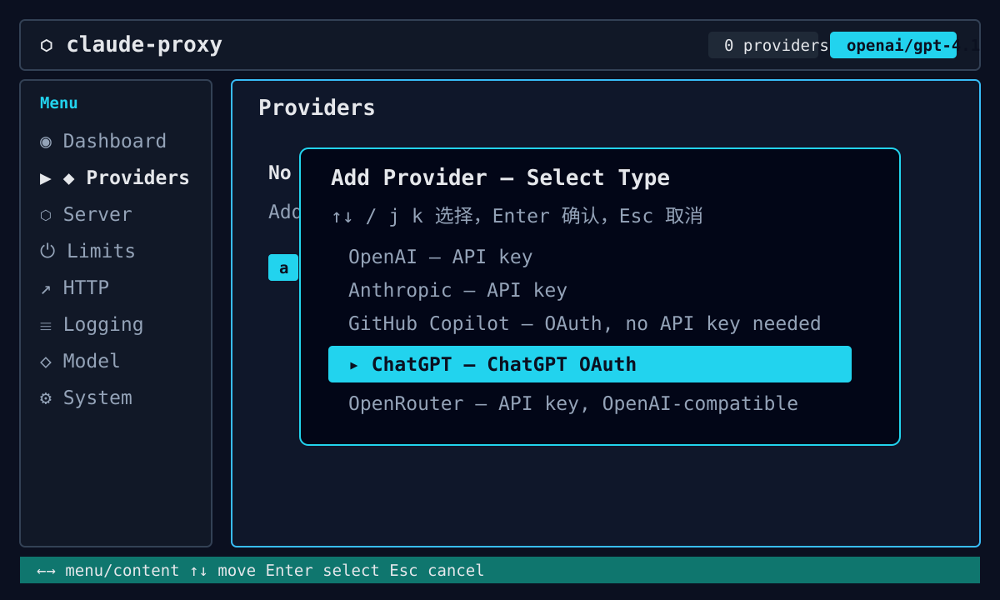

#### 2. 完成 ChatGPT OAuth 登录

选择 ChatGPT 后，TUI 会自动创建 `chatgpt` provider，并立即进入 OAuth 设备码流程：

- 弹窗中会显示验证地址和一次性 user code。
- 按 `u` 可复制验证地址，按 `c` 可复制 user code。
- 在浏览器中打开验证地址，登录 ChatGPT Pro/Plus 账号并确认授权。
- 授权完成后，TUI 会自动保存 OAuth token；后续也可以在 Providers 页选中 `chatgpt` 后按 `o` 重新认证。

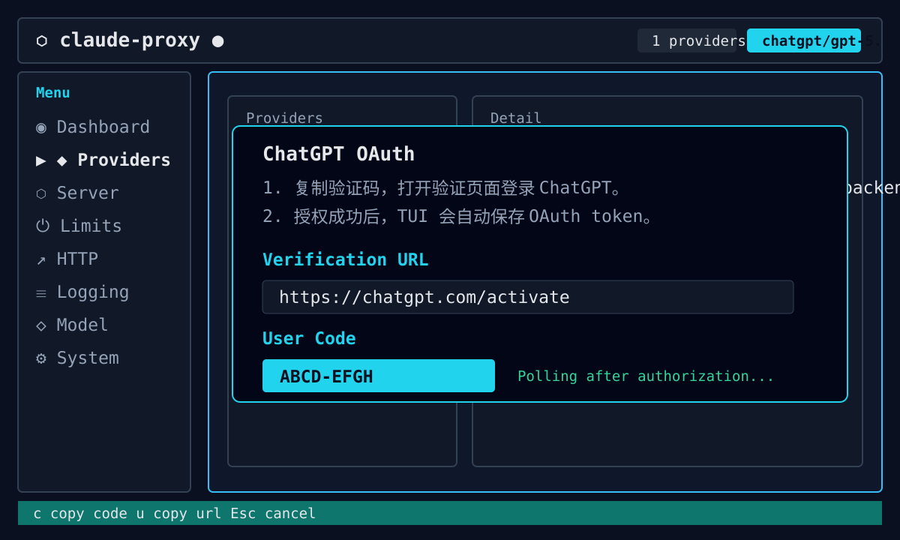

ChatGPT 使用 OAuth，因此 Providers 详情里的 **API Key** 会显示为 `OAuth (auto)`，不需要手动填写。通常只需要确认：

| 字段 | 推荐值 | 说明 |
|------|--------|------|
| `API Key` | `OAuth (auto)` | ChatGPT provider 自动维护 token |
| `Base URL` | `https://chatgpt.com/backend-api/codex` | 默认值即可 |
| `Proxy` | 留空或代理地址 | 需要 HTTP/SOCKS 代理时填写 |
| `Claude Context` | `AUTO` | 上游真实窗口大于 200k 时，让 Claude Code 使用虚拟 1M 窗口 |

如果需要修改 `Base URL` 或 `Proxy`：在 Providers 详情页按 `→` / `Enter` 进入详情，移动到字段后按 `e` 编辑，确认后按 `Ctrl+S` 保存。

使用 Pi 0.76.0+ 作为客户端时，自动化脚本可以用 `pi --session-id <id>` 固定项目内会话。claude-proxy 会把安全的客户端 session header 转成 ChatGPT prompt-cache / continuation key，稳定 session id 有助于提高 ChatGPT/Codex 的缓存亲和性。

高级场景可以在 TOML 里覆盖 ChatGPT Codex 请求身份头；默认值通常不需要修改，默认会使用 Codex 风格的 `originator` 和 `User-Agent`。`User-Agent` 会优先使用本地 `codex --version` 探测到的版本；探测失败时使用内置默认值：

```toml
[providers.chatgpt.chatgpt]
# originator = "codex_cli_rs"
# user_agent = "codex_cli_rs/1.0.0 (claude-proxy)"
# claude_code_context = "auto" # "standard" 可关闭虚拟 1M 投影

# 可选：在线 /models 目录不可用或需要本地强制覆盖时使用。
[providers.chatgpt.chatgpt.model_capabilities."gpt-5.6-sol"]
context_window = 272000
image_input = true
reasoning_effort_levels = ["low", "medium", "high", "xhigh", "max", "ultra"]
responses_lite = true
```

ChatGPT provider 会优先通过 OAuth 从 Codex `/models` 获取在线模型目录，并把最近一次成功获取的上下文能力写入 XDG cache 下的 `claude-proxy/chatgpt/model-capabilities.json`。能力来源优先级为：显式 `model_capabilities` 覆盖 > 同 provider / Base URL / 账号哈希 / 模型的远端缓存 > 内置能力表。缓存不保存原始账号或 token，并采用临时文件加原子重命名写入。

当前内置 GPT-5.6 回退能力如下：

| 模型 | 用途 | Context | 推理强度 | Responses Lite |
|------|------|---------|----------|----------------|
| `gpt-5.6-sol` | 默认 / Reasoning / Opus | 272k | `low`…`ultra` | 是 |
| `gpt-5.6-terra` | Sonnet | 272k | `low`…`ultra` | 是 |
| `gpt-5.6-luna` | Haiku | 272k | `low`…`max` | 是 |

所有新建 ChatGPT 映射默认使用 `high`。TUI 的 Reasoning picker 对所有 Provider 都按当前模型声明的 `reasoning_effort_levels` 过滤，并在打开时按需拉取、缓存模型能力；能力明确为空时只显示 `unset`，拿不到能力或使用目录外的自定义模型时才显示完整兼容列表。以 GPT-5.6 为例，Sol/Terra 显示 `low` 到 `ultra`，Luna 只显示 `low` 到 `max`，不会再给 Luna 显示 `default`、`none` 或 `minimal`。`unset` 用于清除代理侧强制覆盖。`ultra` 遵循 Codex 语义：上游请求发送 `max`；Sol/Terra 且请求包含委派工具时，同时启用主动多代理指令，否则仅按 `max` 发送并记录警告。Luna 不支持 `ultra`，会降为 `max`。

#### Claude Code 虚拟 1M 与真实上游窗口

Claude Code 2.1.206+ 支持通过模型名 `[1m]` 后缀启用 1M 上下文协议。`claude_code_context = "auto"` 是默认值：对真实上下文大于 200k 的 ChatGPT 模型，TUI 保存时只在同步到 Claude Code 的五个模型环境变量上追加 `[1m]`；代理内部的 `ModelInfo.context_window` 仍保持上游真实值，例如 GPT-5.6 为 272k。设置为 `standard` 或在 Providers 页把 **Claude Context** 切到 `OFF` 可关闭投影。

代理不删除历史消息，也不向上游额外发起压缩请求。虚拟 1M 请求会在本地按内容估算 token；同一账号、模型和稳定 session 的连续请求优先采用“最近一次上游 usage + 新增 delta”，否则使用完整粗估，图片和文档按固定 2000 token 计入而不是按 base64 长度。接近真实窗口时，代理在上游请求前返回 Claude Code 可识别的 HTTP 400 `invalid_request_error`：

```text
Prompt is too long: N tokens > M maximum safe input (model context window: W; local estimate based on SOURCE)
```

普通且有可压缩历史的请求、以及压缩后的续接请求，安全输入线为 `真实窗口 - 33k`；压缩摘要生成和没有可压缩历史的请求使用 `真实窗口 - 20k`。对 272k 模型分别是 239k 和 252k。Claude Code 收到提示后负责生成摘要并续接；若本地估算漏过，上游真正的 prompt-too-long 也会归一化成同类 HTTP 400，但 `input + max_tokens` 的输出预算错误保持独立恢复语义。TUI Model 页会显示虚拟窗口、真实窗口和两条阈值，Dashboard 会统计 1M 请求、本地拦截和上游漏拦截。

#### 3. 设置默认模型和 Claude 模型别名

进入左侧 **Model** 页面，为 Claude Code 常用模型名配置路由。字段格式都是：

```text
provider_id/model_name
```

ChatGPT provider 的 provider id 默认为 `chatgpt`。新建 provider 时会自动采用分层映射：

```toml
[model]
default = { name = "chatgpt/gpt-5.6-sol", reasoning_effort = "high" }
reasoning = { name = "chatgpt/gpt-5.6-sol", reasoning_effort = "high" }
opus = { name = "chatgpt/gpt-5.6-sol", reasoning_effort = "high" }
sonnet = { name = "chatgpt/gpt-5.6-terra", reasoning_effort = "high" }
haiku = { name = "chatgpt/gpt-5.6-luna", reasoning_effort = "high" }
```

在 TUI 中编辑方式：

- 在 **Model** 页选择 `Default`、`Reasoning`、`Opus Alias`、`Sonnet Alias` 或 `Haiku Alias`。
- 按 `e` / `Enter` 后，先选择 `chatgpt` provider。
- TUI 会拉取模型列表；选择目标模型后按 `Enter` 写入字段。
- 重复设置需要的 alias，最后按 `Ctrl+S` 保存。

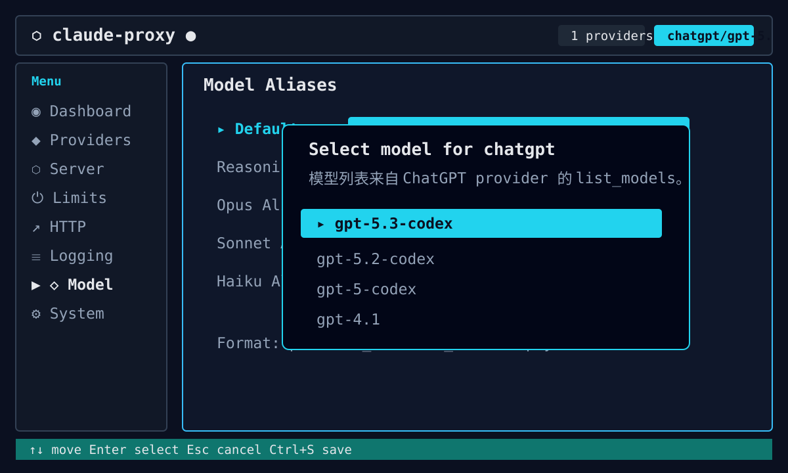

> 如果拉取模型列表失败，先回到 Providers 页选中 `chatgpt` 按 `t` 做连通性检查；如果 OAuth 过期，按 `o` 重新登录。

#### 4. 配置本地服务和 Claude Code 连接参数

进入 **Server** 页面确认本地代理监听参数：

| 字段 | 示例 | 说明 |
|------|------|------|
| `Host` | `127.0.0.1` | 只给本机 Claude Code 使用时推荐保留本地地址 |
| `Port` | `8082` | 本地代理端口 |
| `Auth Token` | `freecc` | Claude Code 连接本地代理时使用的 API key |
| `Admin Token` | 留空或自定义 | 管理接口 token；留空时复用 `Auth Token` |

按 `Ctrl+S` 保存后，TUI 会写入 `~/.config/claude-proxy/config.toml`，并同步 Claude Code 配置里的环境变量：

```json
{
  "env": {
    "ANTHROPIC_BASE_URL": "http://127.0.0.1:8082",
    "ANTHROPIC_API_KEY": "freecc",
    "ANTHROPIC_MODEL": "chatgpt/gpt-5.6-sol[1m]",
    "ANTHROPIC_REASONING_MODEL": "chatgpt/gpt-5.6-sol[1m]",
    "ANTHROPIC_DEFAULT_OPUS_MODEL": "chatgpt/gpt-5.6-sol[1m]",
    "ANTHROPIC_DEFAULT_SONNET_MODEL": "chatgpt/gpt-5.6-terra[1m]",
    "ANTHROPIC_DEFAULT_HAIKU_MODEL": "chatgpt/gpt-5.6-luna[1m]",
    "CLAUDE_CODE_ATTRIBUTION_HEADER": "0",
    "CLAUDE_CODE_MAX_OUTPUT_TOKENS": "128000"
  }
}
```

#### 5. 启动服务并验证

退出 TUI 后启动代理：

```bash
claude-proxy server start
```

再用 Claude Code 或任意 Anthropic Messages API 客户端访问本地代理。请求模型名可以直接使用：

- `chatgpt/gpt-5.6-sol` / `terra` / `luna`：精确路由到 ChatGPT provider 的对应能力层。
- `opus` / `sonnet` / `haiku` / `reasoning`：由上面的 alias 路由到 ChatGPT。

如果要确认配置是否生效：

```bash
claude-proxy provider list
claude-proxy provider current
claude-proxy provider test chatgpt
claude-proxy config show
```

常用按键速查：

| 按键 | 作用 |
|------|------|
| `↑↓` / `j k` | 移动选择 |
| `←→` / `h l` | 左侧菜单和内容区切换；Providers 页也用于列表/详情切换 |
| `a` | 添加 provider |
| `e` / `Enter` | 编辑当前字段或进入详情 |
| `t` | 测试当前 provider |
| `o` | OAuth provider 重新认证 |
| `Space` | Logging 页切换布尔开关 |
| `Ctrl+S` | 保存配置并同步 Claude Code 环境变量 |
| `Esc` / `q` | 返回或退出；有未保存改动时会提示保存 |

## 配置文件

路径：`~/.config/claude-proxy/config.toml`

```toml
[providers.openai]
api_key = "sk-..."
base_url = "https://api.openai.com/v1"
proxy = ""                              # 可选，HTTP 代理地址
provider_type = "openai"                # 可选；省略时按 provider ID 推断

[providers.openrouter]
api_key = "sk-or-..."
base_url = "https://openrouter.ai/api/v1"
provider_type = "openrouter"

[providers.anthropic]
api_key = "sk-ant-..."
base_url = "https://api.anthropic.com"
provider_type = "anthropic"

# GitHub Copilot provider（OAuth 自动认证，无需 api_key）
[providers.copilot]
base_url = "https://api.githubcopilot.com"
provider_type = "copilot"

[providers.copilot.copilot]
oauth_app = "vscode"                    # OAuth 应用: "vscode" 或 "opencode"
small_model = "gpt-5-mini"              # warmup 降级模型
max_thinking_tokens = 16000              # 最大思考 token 数
enable_warmup = true                     # 启用 warmup 检测（无工具请求自动降级）
enable_tool_result_merge = true          # 启用 tool_result 合并
enable_compact_detection = true          # 启用 compact/auto-continue 检测
enable_agent_marking = true              # 启用子 agent 流量标记
enable_responses_api = true              # 对 Copilot 启用 Responses API 路径

# ChatGPT provider（OAuth 自动认证，无需 api_key）
[providers.chatgpt]
base_url = "https://chatgpt.com/backend-api/codex"
provider_type = "chatgpt"

[providers.chatgpt.chatgpt]
# originator = "codex_cli_rs"
# user_agent = "codex_cli_rs/1.0.0 (claude-proxy)"

[model]
default = "openai/gpt-4.1"
reasoning = "openai/o4-mini"
opus = "anthropic/claude-opus-4-20250514"
sonnet = "anthropic/claude-sonnet-4-20250514"
haiku = "anthropic/claude-haiku-4-5-20251001"

[server]
host = "127.0.0.1"
port = 8082
auth_token = "freecc"                   # 客户端连接所需的 API key
sse_heartbeat_interval_seconds = 15     # 下游 SSE keepalive 心跳间隔
stream_idle_timeout_seconds = 120       # 上游流无事件超时
stream_overall_timeout_seconds = 600    # 单次流式请求总超时
tool_use_terminal_timeout_seconds = 30  # tool_use 开始后等待 message_stop 的超时

[admin]
auth_token = ""                         # 留空时使用 server.auth_token

[limits]
rate_limit = 40                         # 时间窗口内最大请求数
rate_window = 60                        # 时间窗口（秒）
max_concurrency = 5                     # 全局最大并发请求数
provider_max_concurrency = 4            # 单个上游 provider 最大并发请求数
model_cache_ttl_seconds = 3600          # 上游模型列表缓存时长（秒）

[http]
read_timeout = 300                      # 上游读取超时（秒）
write_timeout = 60                      # 上游写入超时（秒）
connect_timeout = 60                    # 上游连接超时（秒）
extra_ca_certs = []                     # 额外 CA 证书路径，适合企业 TLS 代理

[log]
level = "info"
file = ""                               # 默认写入 config_dir/claude-proxy.log
with_stdout = true
raw_api_payloads = false                # 调试时再开启，可能包含敏感信息
raw_sse_events = false
```

## HTTP API

### 代理接口

| 方法 | 路径 | 说明 |
|------|------|------|
| `GET` | `/health` | 健康检查 |
| `POST` | `/v1/messages` | Anthropic Messages API 代理 |
| `POST` | `/v1/chat/completions` | OpenAI Chat Completions 兼容代理 |
| `POST` | `/v1/responses` | OpenAI Responses 兼容代理 |
| `GET` | `/v1/models` | 获取可用模型列表 |

两个 OpenAI 兼容接口均支持流式/非流式文本、reasoning、function tool、tool
历史、usage 以及图片 URL/data URL 输入。Responses 接口按无状态模式工作：
`store: true`、`background: true`、`previous_response_id`、`conversation` 和
`item_reference` 等依赖服务端状态的字段会明确返回错误，不会静默忽略；暂不暴露
Responses WebSocket 传输和 structured output 格式。

### OpenAI 客户端接入

将代理的 `/v1` 地址设置为 OpenAI Base URL，并使用 `server.auth_token` 作为
API Key。模型名可以使用下面的 `provider_id/model_name` 完整形式，也可以使用
`[model]` 中配置的别名。

```bash
export OPENAI_BASE_URL=http://127.0.0.1:8082/v1
export OPENAI_API_KEY=your-server-auth-token
```

Chat Completions：

```bash
curl "$OPENAI_BASE_URL/chat/completions" \
  -H "Authorization: Bearer $OPENAI_API_KEY" \
  -H "Content-Type: application/json" \
  -d '{
    "model": "openai/gpt-4.1",
    "messages": [{"role": "user", "content": "你好"}],
    "stream": false
  }'
```

Responses：

```bash
curl "$OPENAI_BASE_URL/responses" \
  -H "Authorization: Bearer $OPENAI_API_KEY" \
  -H "Content-Type: application/json" \
  -d '{
    "model": "openai/gpt-4.1",
    "input": "你好",
    "stream": false
  }'
```

Python SDK：

```python
from openai import OpenAI

client = OpenAI(
    base_url="http://127.0.0.1:8082/v1",
    api_key="your-server-auth-token",
)

response = client.chat.completions.create(
    model="openai/gpt-4.1",
    messages=[{"role": "user", "content": "你好"}],
)
print(response.choices[0].message.content)
```

JavaScript SDK：

```javascript
import OpenAI from "openai";

const client = new OpenAI({
  baseURL: "http://127.0.0.1:8082/v1",
  apiKey: "your-server-auth-token",
});

const response = await client.responses.create({
  model: "openai/gpt-4.1",
  input: "你好",
});
console.log(response.output_text);
```

### 管理接口

管理接口需要 `Authorization: Bearer <admin_token>`。如果未设置 `admin.auth_token`，会使用 `server.auth_token` 作为 fallback。

| 方法 | 路径 | 说明 |
|------|------|------|
| `GET` | `/admin/config` | 获取当前配置（密钥脱敏） |
| `PUT` | `/admin/config` | 更新配置（请求体：`{"config": "<toml>"}`） |
| `POST` | `/admin/restart` | 从磁盘重新加载配置 |
| `GET` | `/admin/metrics` | 获取请求指标（含全量历史数据） |

`GET /admin/metrics` 返回 JSON：

```json
{
  "requests_total": 42,
  "errors_total": 1,
  "avg_latency_ms": 320,
  "models": {
    "openai/gpt-4.1": {
      "requests": 30,
      "input_tokens": 15000,
      "output_tokens": 8000,
      "cache_creation_input_tokens": 0,
      "cache_read_input_tokens": 2000
    }
  },
  "diagnostics": {
    "errors": 1,
    "terminal_reasons": {
      "provider_error": 1
    },
    "error_kinds": {
      "rate_limited": 1
    }
  },
  "observability": {
    "summary": {
      "requests": 42,
      "errors": 1,
      "avg_total_latency_ms": 320,
      "avg_upstream_connect_ms": 80,
      "max_event_gap_ms": 120,
      "idle_gap_count": 0,
      "prompt_too_long_retries": 0
    }
  },
  "stored": {
    "requests_total": 1500,
    "errors_total": 12,
    "avg_latency_ms": 305,
    "models": {},
    "diagnostics": {}
  }
}
```

- 顶层字段是当前进程会话内的统计。
- `avg_latency_ms` 表示已完成请求的端到端耗时；流式请求会在 stream 结束后计入。
- `diagnostics` 按结束原因和错误类型聚合错误请求，方便定位 auth、rate limit、stream 等问题。
- `observability.summary` 汇总请求阶段耗时、上游连接耗时、最大事件间隔和 prompt-too-long retry 次数。
- `active_streams` 显示当前未结束的流式请求（仅 request/provider/model/耗时/最后事件类型，不包含 prompt 内容），用于诊断长会话卡住位置。
- `stored` 是 SQLite 持久化的历史累计，跨重启保留。
- TUI Dashboard 会合并实时数据和历史数据展示总计。

## 特性清单

| 能力 | 说明 |
|------|------|
| Anthropic Messages API 兼容 | 对 Claude Code/SDK 暴露熟悉的 `/v1/messages` 接口 |
| OpenAI 流式转换 | 将 OpenAI Chat Completion SSE 转为 Anthropic SSE |
| Anthropic 透传 | 支持官方 Anthropic API 和自定义 Anthropic 兼容端点 |
| Copilot OAuth | 自动完成 GitHub OAuth，模拟 VS Code/Copilot 请求头 |
| ChatGPT OAuth | 使用 ChatGPT 账号 device flow，token 保存在本机配置目录 |
| Provider 模型缓存 | 启动时预热模型列表，TUI/CLI 可复用缓存 |
| 重复请求去重 | 相同并发请求共享一次上游调用，减少浪费 |
| 限流与并发 | API key 级限流、全局并发、单 Provider 并发保护 |
| 热重载 | 文件监听和 SIGUSR1 均可触发配置 reload |
| 持久化指标 | 请求、错误、延迟、模型 token 用量写入 SQLite |
| TUI Dashboard | 终端内查看实时/历史统计和配置状态 |
| 企业网络支持 | Provider 代理和 `extra_ca_certs` 适配企业 TLS 拦截环境 |

## 与其他开源工具对比

| 工具 | 核心定位 | claude-proxy 的差异 |
|------|----------|---------------------|
| LiteLLM Proxy | 通用 LLM 网关，覆盖大量模型 API | claude-proxy 更聚焦 Claude Code/Anthropic Messages API 本地代理，单二进制和 TUI 更轻量 |
| OpenRouter | 托管式多模型路由平台 | claude-proxy 可把 OpenRouter 作为上游，同时保留本地配置、认证和指标控制权 |
| LocalAI / vLLM | 本地模型推理服务 | claude-proxy 不负责推理，而是统一转发到云端、账号型或私有兼容上游 |
| one-api / new-api | 多渠道 API 分发与管理面板 | claude-proxy 更适合开发者本机和 Claude Code 工作流，支持 Copilot/ChatGPT OAuth 与终端操作 |
| 简单反向代理 | HTTP 转发 | claude-proxy 会理解 Anthropic/OpenAI 协议、模型路由、流式事件、token 指标和 Provider 生命周期 |

如果你已经有 LiteLLM、one-api、new-api 或自建 OpenAI 兼容网关，`claude-proxy` 仍然可以作为 Claude Code 前置适配层，把这些服务包装成 Claude 兼容入口。

## 典型使用场景

- **Claude Code 多模型切换**：在一个终端会话里用不同 alias 切换 GPT、Claude、Gemini 或 OpenRouter 模型。
- **复用 Copilot / ChatGPT 账号能力**：通过 OAuth provider 接入账号型上游，减少手动管理 token 的成本。
- **团队内统一出口**：给团队提供一个 Anthropic 兼容入口，同时在本地记录用量和延迟。
- **企业网络环境**：通过代理和额外 CA 证书访问上游模型服务。
- **调试模型成本**：用 TUI Dashboard 观察模型维度 token 用量和错误率。

## 从源码构建

```bash
cargo build --release
# 二进制文件位于 target/release/claude-proxy
```

构建 Linux musl 静态链接版本：

```bash
rustup target add x86_64-unknown-linux-musl
cargo build --release --target x86_64-unknown-linux-musl
# 二进制文件位于 target/x86_64-unknown-linux-musl/release/claude-proxy
```

常用开发命令：

```bash
cargo test
cargo clippy -- -D warnings
cargo fmt --check
```

## 许可证

MIT
